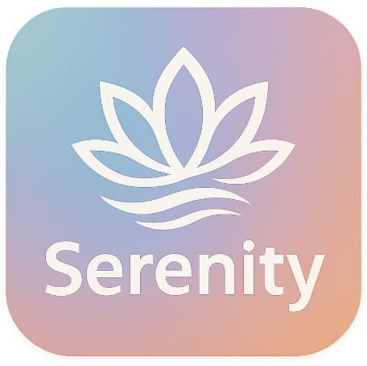

# IUM2024-2025_Gruppo6
Progetto di Interazione Uomo-Macchina 2024/2025 - Gruppo 6
# SERENITY
<p align="center">

</p>


Serenity è un'applicazione interattiva progettata per il benessere mentale e il supporto emotivo, focalizzata sugli obiettivi di Good Health and Well-being del Sustainable Development Goals (SDGs). L'app è pensata per offrire uno spazio di supporto emotivo attraverso un'interfaccia intuitiva che promuove la gestione dello stress, delle emozioni e delle difficoltà quotidiane.

## Caratteristiche principali <br>
- **Monitoraggio del benessere emotivo**: Gli utenti possono monitorare il proprio stato d'animo e ricevere feedback personalizzati per migliorare il loro benessere.

- **Supporto emotivo interattivo**: L'app offre sessioni guidate di meditazione, esercizi di rilassamento e tecniche di gestione dello stress.

- **Raccolta e analisi dei dati**: I dati sullo stato emotivo dell'utente vengono raccolti localmente per fornire una panoramica dettagliata e suggerire miglioramenti.

- **Sistema di notifiche personalizzate**: Ricevi suggerimenti personalizzati basati sul tuo stato emotivo, sulla frequenza di utilizzo e sugli obiettivi di benessere.

- **Accessibilità**: L'app è progettata per essere utilizzata da diverse tipologie di utenti, con un focus sulla facilità di navigazione e usabilità.

## Tecnologie utilizzate
- **Frontend:** Angular (stand-alone components) con Ionic per creare un'interfaccia utente reattiva e mobile-friendly.

- **Backend**: Node.js per la gestione delle richieste, senza necessità di un database esterno.


## Installazione
### Requisiti
- Node.js (versione 16 o superiore)

- Angular CLI

- Ionic CLI

### Passaggi
 1. **Apri il terminale ed esegui il comando seguente per clonare la repository:**
    ```bash
    git clone https://github.com/AlessandraTro/IUM2024-2025_Gruppo6.git
    ```
 2. **Apri il progetto con un ambiente di sviluppo a tua scelta (si consiglia IntelliJ).**
 3. **Nel terminale dell’ambiente di sviluppo:**
    ```bash
    cd frontend
    ```
 4. **Verifica la presenza di npm:**
    ```bash
    npm -v
    ```
    Se npm non è presente, scaricalo da qui (https://nodejs.org/en/download) e poi verificane nuovamente la versione.

 5. **Installa le dipendenze con:**
    ```bas
    npm install
    ```
    5.1 **Se ricevi un errore, esegui:**
      ```bash
      npm install --legacy-peer-deps
      ``` 
 6. **Installa Ionic CLI globalmente:**
    ```bash
    npm install -g @ionic/cli
    ``` 
 7. **Avvia il server di sviluppo con:**
    ```bash
    ionic serve --external
    ```
    Questo comando genererà un link che potrai inviare al tuo telefono per aprire il progetto.

## Struttura del progetto

- **frontend/**: Codice sorgente dell'interfaccia utente (Angular e Ionic). Poichè non esiste un database esterno, questa cartella conterrà il servizio in memoria (in-memory-data.service.ts) che simula un database.
- **Assignment/**: Documenti relativi ai 4 Assignments e la presentazione del progetto.
- **Questionari/**: Questionari fatti
- **Assets/**: Logo dell'app

## Contributi

Contribuire a Serenity è facile:

1. Forka il repository.
2. Crea un branch per la tua feature o fix:
   ```bash
   git checkout -b nome-feature
   ```
3. Effettua le modifiche e assicurati che il codice sia formattato.
4. Esegui i test per garantire che tutto funzioni correttamente.
5. Fai una pull request verso il branch principale.

## Utente Base
Per il login come utente base, usa le seguenti credenziali:

- Email: saraVitale@gmail.com

- Password: 1234

## Gruppo 6 – IUM 2024/2025

- Anna Atte 
- Anna Tagliamonte
- Alessandra Trotta

Università degli Studi di Salerno
- Corso: Interazione Uomo-Macchina
- Professoressa: Giuliana Vitiello
- Tutor: Andrea Antonio Cantone

